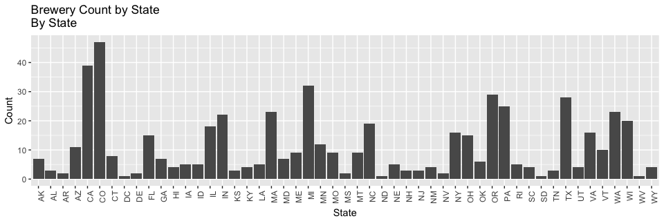
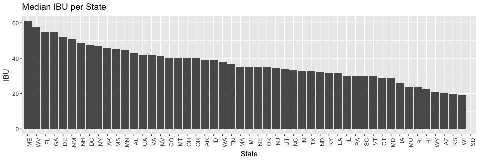
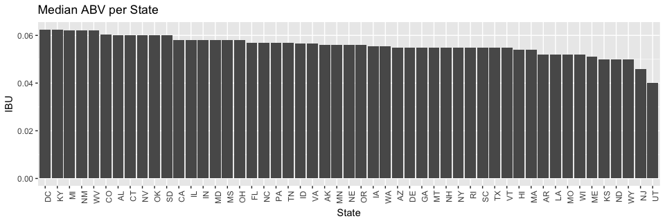
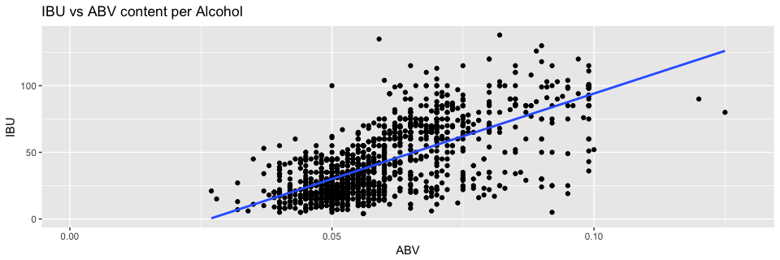

### URL
https://github.com/lepealec/MSDS-6306-First-Case-Study.git

### Data description.

### Load and preview data

```r
setwd("~/MSDS-6306-First-Case-Study/Guidlines")
beers=fread("beers.csv")
beers
```

```
##                       Name Beer_ID   ABV IBU Brewery_id
##    1:             Pub Beer    1436 0.050  NA        409
##    2:          Devil's Cup    2265 0.066  NA        178
##    3:  Rise of the Phoenix    2264 0.071  NA        178
##    4:             Sinister    2263 0.090  NA        178
##    5:        Sex and Candy    2262 0.075  NA        178
##   ---                                                  
## 2406:            Belgorado     928 0.067  45        425
## 2407:        Rail Yard Ale     807 0.052  NA        425
## 2408:      B3K Black Lager     620 0.055  NA        425
## 2409:  Silverback Pale Ale     145 0.055  40        425
## 2410: Rail Yard Ale (2009)      84 0.052  NA        425
##                                Style Ounces
##    1:            American Pale Lager     12
##    2:        American Pale Ale (APA)     12
##    3:                   American IPA     12
##    4: American Double / Imperial IPA     12
##    5:                   American IPA     12
##   ---                                      
## 2406:                    Belgian IPA     12
## 2407:       American Amber / Red Ale     12
## 2408:                    Schwarzbier     12
## 2409:        American Pale Ale (APA)     12
## 2410:       American Amber / Red Ale     12
```

```r
breweries=fread("breweries.csv")
breweries
```

```
##      Brew_ID                          Name          City State
##   1:       1             NorthGate Brewing   Minneapolis    MN
##   2:       2     Against the Grain Brewery    Louisville    KY
##   3:       3      Jack's Abby Craft Lagers    Framingham    MA
##   4:       4     Mike Hess Brewing Company     San Diego    CA
##   5:       5       Fort Point Beer Company San Francisco    CA
##  ---                                                          
## 554:     554           Covington Brewhouse     Covington    LA
## 555:     555               Dave's Brewfarm        Wilson    WI
## 556:     556         Ukiah Brewing Company         Ukiah    CA
## 557:     557       Butternuts Beer and Ale Garrattsville    NY
## 558:     558 Sleeping Lady Brewing Company     Anchorage    AK
```


### How many breweries are the per state?
By state,

```r
ct_brew=table(breweries[["State"]])
ct_brew[sort(names(ct_brew))]
```

```
## 
## AK AL AR AZ CA CO CT DC DE FL GA HI IA ID IL IN KS KY LA MA MD ME MI MN MO 
##  7  3  2 11 39 47  8  1  2 15  7  4  5  5 18 22  3  4  5 23  7  9 32 12  9 
## MS MT NC ND NE NH NJ NM NV NY OH OK OR PA RI SC SD TN TX UT VA VT WA WI WV 
##  2  9 19  1  5  3  3  4  2 16 15  6 29 25  5  4  1  3 28  4 16 10 23 20  1 
## WY 
##  4
```

```r
breweries %>% ggplot(aes(x=State)) + geom_bar()+xlab("State")+ylab("Count") + 
  scale_y_continuous(name="Count", labels = scales::comma) +
  ggtitle("Brewery Count by State \nBy State")+theme(axis.text.x = element_text(angle = 90, hjust = 1))
```

<!-- -->

```r
ct_brew[order(ct_brew)]
```

```
## 
## DC ND SD WV AR DE MS NV AL KS NH NJ TN HI KY NM SC UT WY IA ID LA NE RI OK 
##  1  1  1  1  2  2  2  2  3  3  3  3  3  4  4  4  4  4  4  5  5  5  5  5  6 
## AK GA MD CT ME MO MT VT AZ MN FL OH NY VA IL NC WI IN MA WA PA TX OR MI CA 
##  7  7  7  8  9  9  9 10 11 12 15 15 16 16 18 19 20 22 23 23 25 28 29 32 39 
## CO 
## 47
```

```r
breweries[order(breweries[["State"]]),]
```

```
##      Brew_ID                              Name      City State
##   1:     103       King Street Brewing Company Anchorage    AK
##   2:     224      Midnight Sun Brewing Company Anchorage    AK
##   3:     271           Alaskan Brewing Company    Juneau    AK
##   4:     454            Denali Brewing Company Talkeetna    AK
##   5:     459       Kenai River Brewing Company  Soldotna    AK
##  ---                                                          
## 554:     157 Greenbrier Valley Brewing Company Lewisburg    WV
## 555:      80       Black Tooth Brewing Company  Sheridan    WY
## 556:     192       Snake River Brewing Company   Jackson    WY
## 557:     458   The Black Tooth Brewing Company  Sheridan    WY
## 558:     551        Wind River Brewing Company  Pinedale    WY
```

```r
names(ct_brew[order(ct_brew)])
```

```
##  [1] "DC" "ND" "SD" "WV" "AR" "DE" "MS" "NV" "AL" "KS" "NH" "NJ" "TN" "HI"
## [15] "KY" "NM" "SC" "UT" "WY" "IA" "ID" "LA" "NE" "RI" "OK" "AK" "GA" "MD"
## [29] "CT" "ME" "MO" "MT" "VT" "AZ" "MN" "FL" "OH" "NY" "VA" "IL" "NC" "WI"
## [43] "IN" "MA" "WA" "PA" "TX" "OR" "MI" "CA" "CO"
```

```r
breweries %>% ggplot( aes(x=reorder(State,State,
                     function(x)-length(x)))) + geom_bar()+xlab("State")+ylab("Count") + 
  scale_y_continuous(name="Count", labels = scales::comma) +
  ggtitle("Brewery Count by State \nBy Rank")+theme(axis.text.x = element_text(angle = 90, hjust = 1))
```

<!-- -->

Here we can see Colorado (CO), California (CA), and Michigan (MI) have the most breweries with 47, 39, and 32 breweries respectively.

Contrastly, Washington DC (DC), North Dakota (ND), South Dakota (SD), and West Virginia (WV) have the fewest breweries: 1 per state.


```r
nrow(breweries)
```

```
## [1] 558
```

There are a total of 558 breweries listed in the data set.


```r
colnames(breweries)[colnames(breweries)=="Brew_ID"]="Brewery_id"
colnames(breweries)[colnames(breweries)=="Name"]="Brewery_Name"
colnames(beers)[colnames(beers)=="Name"]="Beer_Name"
combined_data=merge(beers,breweries,by="Brewery_id")
nrow(breweries)
```

```
## [1] 558
```

```r
nrow(combined_data)==nrow(beers)
```

```
## [1] TRUE
```
First six observations

```r
head(combined_data)
```

```
##    Brewery_id     Beer_Name Beer_ID   ABV IBU
## 1:          1  Get Together    2692 0.045  50
## 2:          1 Maggie's Leap    2691 0.049  26
## 3:          1    Wall's End    2690 0.048  19
## 4:          1       Pumpion    2689 0.060  38
## 5:          1    Stronghold    2688 0.060  25
## 6:          1   Parapet ESB    2687 0.056  47
##                                  Style Ounces      Brewery_Name
## 1:                        American IPA     16 NorthGate Brewing
## 2:                  Milk / Sweet Stout     16 NorthGate Brewing
## 3:                   English Brown Ale     16 NorthGate Brewing
## 4:                         Pumpkin Ale     16 NorthGate Brewing
## 5:                     American Porter     16 NorthGate Brewing
## 6: Extra Special / Strong Bitter (ESB)     16 NorthGate Brewing
##           City State
## 1: Minneapolis    MN
## 2: Minneapolis    MN
## 3: Minneapolis    MN
## 4: Minneapolis    MN
## 5: Minneapolis    MN
## 6: Minneapolis    MN
```
Last six observations

```r
tail(combined_data)
```

```
##    Brewery_id                 Beer_Name Beer_ID   ABV IBU
## 1:        556             Pilsner Ukiah      98 0.055  NA
## 2:        557  Heinnieweisse Weissebier      52 0.049  NA
## 3:        557           Snapperhead IPA      51 0.068  NA
## 4:        557         Moo Thunder Stout      50 0.049  NA
## 5:        557         Porkslap Pale Ale      49 0.043  NA
## 6:        558 Urban Wilderness Pale Ale      30 0.049  NA
##                      Style Ounces                  Brewery_Name
## 1:         German Pilsener     12         Ukiah Brewing Company
## 2:              Hefeweizen     12       Butternuts Beer and Ale
## 3:            American IPA     12       Butternuts Beer and Ale
## 4:      Milk / Sweet Stout     12       Butternuts Beer and Ale
## 5: American Pale Ale (APA)     12       Butternuts Beer and Ale
## 6:        English Pale Ale     12 Sleeping Lady Brewing Company
##             City State
## 1:         Ukiah    CA
## 2: Garrattsville    NY
## 3: Garrattsville    NY
## 4: Garrattsville    NY
## 5: Garrattsville    NY
## 6:     Anchorage    AK
```
Sum of NA's per column

```r
apply(combined_data,2,function(x) sum(is.na(x)))
```

```
##   Brewery_id    Beer_Name      Beer_ID          ABV          IBU 
##            0            0            0           62         1005 
##        Style       Ounces Brewery_Name         City        State 
##            0            0            0            0            0
```


```r
abv=combined_data[,median(na.omit(as.numeric(ABV))),State]
ibu=combined_data[,median(na.omit(as.numeric(IBU))),State]
colnames(abv)[2]="ABV"
colnames(ibu)[2]="IBU"
meds=merge(ibu,abv,by="State")
```

Median IBU per State Plot

```r
ggplot(meds,aes(reorder(meds$State,-meds$IBU), y = meds$IBU))+geom_bar(stat = "identity")+labs(x = "State" , y = "IBU") + 
  ggtitle("Median IBU per State")+theme(axis.text.x = element_text(angle = 90, hjust = 1))
```

```
## Warning: Removed 1 rows containing missing values (position_stack).
```

<!-- -->
Median ABV per State Plot

```r
ggplot(meds,aes(reorder(meds$State,-meds$ABV), y = meds$ABV))+geom_bar(stat = "identity")+labs(x = "State" , y = "IBU") + 
  ggtitle("Median ABV per State")+theme(axis.text.x = element_text(angle = 90, hjust = 1))
```

<!-- -->


MAX ABV

```r
combined_data[which.max(ABV),]
```

```
##    Brewery_id                                            Beer_Name Beer_ID
## 1:         52 Lee Hill Series Vol. 5 - Belgian Style Quadrupel Ale    2565
##      ABV IBU            Style Ounces            Brewery_Name    City State
## 1: 0.128  NA Quadrupel (Quad)   19.2 Upslope Brewing Company Boulder    CO
```

Max IBU

```r
combined_data[which.max(IBU),]
```

```
##    Brewery_id                 Beer_Name Beer_ID   ABV IBU
## 1:        375 Bitter Bitch Imperial IPA     980 0.082 138
##                             Style Ounces            Brewery_Name    City
## 1: American Double / Imperial IPA     12 Astoria Brewing Company Astoria
##    State
## 1:    OR
```


```r
sum_abv=summary(combined_data[["ABV"]])
sum_abv
```

```
##    Min. 1st Qu.  Median    Mean 3rd Qu.    Max.    NA's 
## 0.00100 0.05000 0.05600 0.05977 0.06700 0.12800      62
```
1

```r
ggplot(combined_data,aes(x = ABV,y = IBU ))+geom_point(na.rm=TRUE)+geom_smooth(method=lm,se=FALSE, na.rm=TRUE)+
  ggtitle("IBU vs ABV content per Alcohol")
```

<!-- -->

```r
cor(na.omit(combined_data)[["ABV"]],na.omit(combined_data)[["IBU"]])
```

```
## [1] 0.6706215
```
2

