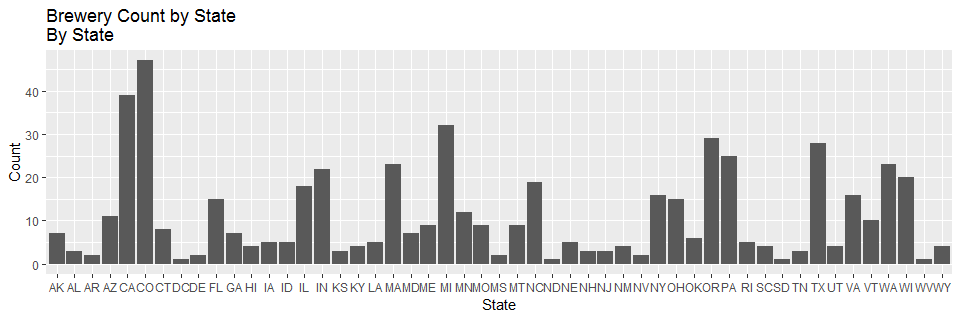

### URL
https://github.com/lepealec/MSDS-6306-First-Case-Study.git

### Data description.

### Load and preview data

```r
setwd("~/MSDS-6306-First-Case-Study/Guidlines")

beers=fread("beers.csv")
beers
```

```
##                       Name Beer_ID   ABV IBU Brewery_id
##    1:             Pub Beer    1436 0.050  NA        409
##    2:          Devil's Cup    2265 0.066  NA        178
##    3:  Rise of the Phoenix    2264 0.071  NA        178
##    4:             Sinister    2263 0.090  NA        178
##    5:        Sex and Candy    2262 0.075  NA        178
##   ---                                                  
## 2406:            Belgorado     928 0.067  45        425
## 2407:        Rail Yard Ale     807 0.052  NA        425
## 2408:      B3K Black Lager     620 0.055  NA        425
## 2409:  Silverback Pale Ale     145 0.055  40        425
## 2410: Rail Yard Ale (2009)      84 0.052  NA        425
##                                Style Ounces
##    1:            American Pale Lager     12
##    2:        American Pale Ale (APA)     12
##    3:                   American IPA     12
##    4: American Double / Imperial IPA     12
##    5:                   American IPA     12
##   ---                                      
## 2406:                    Belgian IPA     12
## 2407:       American Amber / Red Ale     12
## 2408:                    Schwarzbier     12
## 2409:        American Pale Ale (APA)     12
## 2410:       American Amber / Red Ale     12
```

```r
breweries=fread("breweries.csv")
breweries
```

```
##      Brew_ID                          Name          City State
##   1:       1             NorthGate Brewing   Minneapolis    MN
##   2:       2     Against the Grain Brewery    Louisville    KY
##   3:       3      Jack's Abby Craft Lagers    Framingham    MA
##   4:       4     Mike Hess Brewing Company     San Diego    CA
##   5:       5       Fort Point Beer Company San Francisco    CA
##  ---                                                          
## 554:     554           Covington Brewhouse     Covington    LA
## 555:     555               Dave's Brewfarm        Wilson    WI
## 556:     556         Ukiah Brewing Company         Ukiah    CA
## 557:     557       Butternuts Beer and Ale Garrattsville    NY
## 558:     558 Sleeping Lady Brewing Company     Anchorage    AK
```


### How many breweries are the per state?
By state,

```r
ct_brew=table(breweries[["State"]])
ct_brew[sort(names(ct_brew))]
```

```
## 
## AK AL AR AZ CA CO CT DC DE FL GA HI IA ID IL IN KS KY LA MA MD ME MI MN MO 
##  7  3  2 11 39 47  8  1  2 15  7  4  5  5 18 22  3  4  5 23  7  9 32 12  9 
## MS MT NC ND NE NH NJ NM NV NY OH OK OR PA RI SC SD TN TX UT VA VT WA WI WV 
##  2  9 19  1  5  3  3  4  2 16 15  6 29 25  5  4  1  3 28  4 16 10 23 20  1 
## WY 
##  4
```

```r
breweries %>% ggplot(aes(x=State)) + geom_bar()+xlab("State")+ylab("Count") + 
  scale_y_continuous(name="Count", labels = scales::comma) +
  ggtitle("Brewery Count by State \nBy State")
```

<!-- -->

```r
ct_brew[order(ct_brew)]
```

```
## 
## DC ND SD WV AR DE MS NV AL KS NH NJ TN HI KY NM SC UT WY IA ID LA NE RI OK 
##  1  1  1  1  2  2  2  2  3  3  3  3  3  4  4  4  4  4  4  5  5  5  5  5  6 
## AK GA MD CT ME MO MT VT AZ MN FL OH NY VA IL NC WI IN MA WA PA TX OR MI CA 
##  7  7  7  8  9  9  9 10 11 12 15 15 16 16 18 19 20 22 23 23 25 28 29 32 39 
## CO 
## 47
```

```r
barplot(ct_brew[order(ct_brew)])
```

<!-- -->
