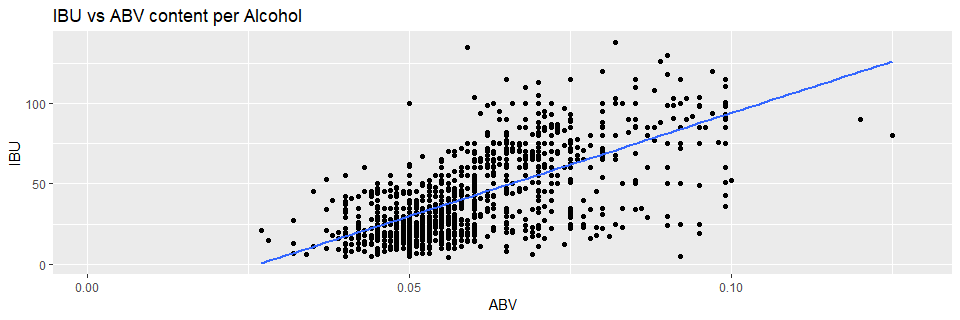

### Introduction

The R Team was presented with two data sets for analysis.  The first set, "Beers.csv" contains a list of 2410 US craft beers and various properties specific to each individual beer.  The second set, "Breweries.csv" contains the city and state data for 558 US breweries, and their unique Brewery ID number.  In alalyzing the data, the following questions and methods will be explored:

* How many breweries are present in each state?
* Merge beer data with the breweries data. Print the first 6
observations and the last six observations to check the merged file.
* Report the number of NA's in each column.
* Compute the median alcohol content and international
bitterness unit for each state. Plot a bar chart to compare.
* Which state has the maximum alcoholic (ABV) beer? Which
state has the most bitter (IBU) beer?
* Summary statistics for the ABV variable.
* Is there an apparent relationship between the bitterness of the
beer and its alcoholic content? Draw a scatter plot.

### URL
https://github.com/lepealec/MSDS-6306-First-Case-Study.git

### Data description.


```r
library("data.table")
library("tidyverse")
library('ggplot2')
sessionInfo()
```

```
## R version 3.5.1 (2018-07-02)
## Platform: x86_64-w64-mingw32/x64 (64-bit)
## Running under: Windows 10 x64 (build 17134)
## 
## Matrix products: default
## 
## locale:
## [1] LC_COLLATE=English_United States.1252 
## [2] LC_CTYPE=English_United States.1252   
## [3] LC_MONETARY=English_United States.1252
## [4] LC_NUMERIC=C                          
## [5] LC_TIME=English_United States.1252    
## 
## attached base packages:
## [1] stats     graphics  grDevices utils     datasets  methods   base     
## 
## other attached packages:
##  [1] forcats_0.3.0     stringr_1.3.1     dplyr_0.7.6      
##  [4] purrr_0.2.5       readr_1.1.1       tidyr_0.8.1      
##  [7] tibble_1.4.2      ggplot2_3.0.0     tidyverse_1.2.1  
## [10] data.table_1.11.8
## 
## loaded via a namespace (and not attached):
##  [1] Rcpp_0.12.18     cellranger_1.1.0 pillar_1.3.0     compiler_3.5.1  
##  [5] plyr_1.8.4       bindr_0.1.1      tools_3.5.1      digest_0.6.15   
##  [9] lubridate_1.7.4  jsonlite_1.5     evaluate_0.11    nlme_3.1-137    
## [13] gtable_0.2.0     lattice_0.20-35  pkgconfig_2.0.2  rlang_0.2.2     
## [17] cli_1.0.0        rstudioapi_0.7   yaml_2.2.0       haven_1.1.2     
## [21] bindrcpp_0.2.2   withr_2.1.2      xml2_1.2.0       httr_1.3.1      
## [25] knitr_1.20       hms_0.4.2        rprojroot_1.3-2  grid_3.5.1      
## [29] tidyselect_0.2.4 glue_1.3.0       R6_2.2.2         readxl_1.1.0    
## [33] rmarkdown_1.10   modelr_0.1.2     magrittr_1.5     backports_1.1.2 
## [37] scales_1.0.0     htmltools_0.3.6  rvest_0.3.2      assertthat_0.2.0
## [41] colorspace_1.3-2 stringi_1.1.7    lazyeval_0.2.1   munsell_0.5.0   
## [45] broom_0.5.0      crayon_1.3.4
```

### Load and preview data

The data was read in using the following code:

```r
setwd("Guidelines")
beers=fread("beers.csv")
breweries=fread("breweries.csv")
```


### How many breweries are there per state?
By executing the following code, we can generate a table representing the number of breweries in each state.

```r
ct_brew=table(breweries[["State"]])
ct_brew[sort(names(ct_brew))]
```

```
## 
## AK AL AR AZ CA CO CT DC DE FL GA HI IA ID IL IN KS KY LA MA MD ME MI MN MO 
##  7  3  2 11 39 47  8  1  2 15  7  4  5  5 18 22  3  4  5 23  7  9 32 12  9 
## MS MT NC ND NE NH NJ NM NV NY OH OK OR PA RI SC SD TN TX UT VA VT WA WI WV 
##  2  9 19  1  5  3  3  4  2 16 15  6 29 25  5  4  1  3 28  4 16 10 23 20  1 
## WY 
##  4
```

This information can be represented graphically for ease of visualization.

```r
breweries %>% ggplot(aes(x=State)) + geom_bar()+xlab("State")+ylab("Count") + 
  scale_y_continuous(name="Count", labels = scales::comma) +
  ggtitle("Brewery Count by State")+theme(axis.text.x = element_text(angle = 90, hjust = 1))
```

<!-- -->
Next we'll sort the data in descending order to get an idea of how each state ranks among the others.

```r
ct_brew[order(ct_brew)]
```

```
## 
## DC ND SD WV AR DE MS NV AL KS NH NJ TN HI KY NM SC UT WY IA ID LA NE RI OK 
##  1  1  1  1  2  2  2  2  3  3  3  3  3  4  4  4  4  4  4  5  5  5  5  5  6 
## AK GA MD CT ME MO MT VT AZ MN FL OH NY VA IL NC WI IN MA WA PA TX OR MI CA 
##  7  7  7  8  9  9  9 10 11 12 15 15 16 16 18 19 20 22 23 23 25 28 29 32 39 
## CO 
## 47
```

```r
breweries[order(breweries[["State"]]),]
```

```
##      Brew_ID                              Name      City State
##   1:     103       King Street Brewing Company Anchorage    AK
##   2:     224      Midnight Sun Brewing Company Anchorage    AK
##   3:     271           Alaskan Brewing Company    Juneau    AK
##   4:     454            Denali Brewing Company Talkeetna    AK
##   5:     459       Kenai River Brewing Company  Soldotna    AK
##  ---                                                          
## 554:     157 Greenbrier Valley Brewing Company Lewisburg    WV
## 555:      80       Black Tooth Brewing Company  Sheridan    WY
## 556:     192       Snake River Brewing Company   Jackson    WY
## 557:     458   The Black Tooth Brewing Company  Sheridan    WY
## 558:     551        Wind River Brewing Company  Pinedale    WY
```

```r
names(ct_brew[order(ct_brew)])
```

```
##  [1] "DC" "ND" "SD" "WV" "AR" "DE" "MS" "NV" "AL" "KS" "NH" "NJ" "TN" "HI"
## [15] "KY" "NM" "SC" "UT" "WY" "IA" "ID" "LA" "NE" "RI" "OK" "AK" "GA" "MD"
## [29] "CT" "ME" "MO" "MT" "VT" "AZ" "MN" "FL" "OH" "NY" "VA" "IL" "NC" "WI"
## [43] "IN" "MA" "WA" "PA" "TX" "OR" "MI" "CA" "CO"
```

```r
breweries %>% ggplot( aes(x=reorder(State,State,
                     function(x)-length(x)))) + geom_bar()+xlab("State")+ylab("Count") + 
  scale_y_continuous(name="Count", labels = scales::comma) +
  ggtitle("Brewery Count by State \nBy Rank")+theme(axis.text.x = element_text(angle = 90, hjust = 1))
```

<!-- -->

Here we can see Colorado (CO), California (CA), and Michigan (MI) have the most breweries with 47, 39, and 32 breweries respectively.

Conversely, Washington DC (DC), North Dakota (ND), South Dakota (SD), and West Virginia (WV) have the fewest breweries at 1 per state.

The total number of breweries can be found as follows:

```r
nrow(breweries)
```

```
## [1] 558
```

We see there are a total of 558 breweries listed in the data set.

### Merge beer data with the breweries data. Print the first 6 observations and the last six observations to check the merged file.

By merging the two data sets together, we can peform more complex operations to better understand the data contained within.

```r
colnames(breweries)[colnames(breweries)=="Brew_ID"]="Brewery_id"
colnames(breweries)[colnames(breweries)=="Name"]="Brewery_Name"
colnames(beers)[colnames(beers)=="Name"]="Beer_Name"
combined_data=merge(beers,breweries,by="Brewery_id")
```
First six observations of the combined data set:

```r
head(combined_data)
```

```
##    Brewery_id     Beer_Name Beer_ID   ABV IBU
## 1:          1  Get Together    2692 0.045  50
## 2:          1 Maggie's Leap    2691 0.049  26
## 3:          1    Wall's End    2690 0.048  19
## 4:          1       Pumpion    2689 0.060  38
## 5:          1    Stronghold    2688 0.060  25
## 6:          1   Parapet ESB    2687 0.056  47
##                                  Style Ounces      Brewery_Name
## 1:                        American IPA     16 NorthGate Brewing
## 2:                  Milk / Sweet Stout     16 NorthGate Brewing
## 3:                   English Brown Ale     16 NorthGate Brewing
## 4:                         Pumpkin Ale     16 NorthGate Brewing
## 5:                     American Porter     16 NorthGate Brewing
## 6: Extra Special / Strong Bitter (ESB)     16 NorthGate Brewing
##           City State
## 1: Minneapolis    MN
## 2: Minneapolis    MN
## 3: Minneapolis    MN
## 4: Minneapolis    MN
## 5: Minneapolis    MN
## 6: Minneapolis    MN
```
Last six observations of the combined data set:

```r
tail(combined_data)
```

```
##    Brewery_id                 Beer_Name Beer_ID   ABV IBU
## 1:        556             Pilsner Ukiah      98 0.055  NA
## 2:        557  Heinnieweisse Weissebier      52 0.049  NA
## 3:        557           Snapperhead IPA      51 0.068  NA
## 4:        557         Moo Thunder Stout      50 0.049  NA
## 5:        557         Porkslap Pale Ale      49 0.043  NA
## 6:        558 Urban Wilderness Pale Ale      30 0.049  NA
##                      Style Ounces                  Brewery_Name
## 1:         German Pilsener     12         Ukiah Brewing Company
## 2:              Hefeweizen     12       Butternuts Beer and Ale
## 3:            American IPA     12       Butternuts Beer and Ale
## 4:      Milk / Sweet Stout     12       Butternuts Beer and Ale
## 5: American Pale Ale (APA)     12       Butternuts Beer and Ale
## 6:        English Pale Ale     12 Sleeping Lady Brewing Company
##             City State
## 1:         Ukiah    CA
## 2: Garrattsville    NY
## 3: Garrattsville    NY
## 4: Garrattsville    NY
## 5: Garrattsville    NY
## 6:     Anchorage    AK
```

### Report the number of NA's in each column.
Sum of NA's per column:

```r
apply(combined_data,2,function(x) sum(is.na(x)))
```

```
##   Brewery_id    Beer_Name      Beer_ID          ABV          IBU 
##            0            0            0           62         1005 
##        Style       Ounces Brewery_Name         City        State 
##            0            0            0            0            0
```
The above code searches every column of the combined data set and adds up each occurance of an NA for every column.

### Compute the median alcohol content and international bitterness unit for each state. Plot a bar chart to compare.

Next we explore the median Alcohol By Volume (ABV) and International Bittering Unit (IBU) of each state.  The code below gathers the medians for ABV and IBU for each state and presents the data in a barchart.


```r
abv=combined_data[,median(na.omit(as.numeric(ABV))),State]
ibu=combined_data[,median(na.omit(as.numeric(IBU))),State]
colnames(abv)[2]="ABV"
colnames(ibu)[2]="IBU"
meds=merge(ibu,abv,by="State")
```


```r
alcohol <- melt(meds, na.rm=T, id="State")
names(alcohol) <- c("State", "Metric", "Value")
# One NA value is found corresponding to IBU for SD.  I replace it with 0.
alcohol$Value[which(is.na(alcohol$Value))] <- 0
# Make ABV values negative for proper display on the barplot
alcohol$Value[as.character(alcohol$Metric)=="ABV"] <- -100*alcohol$Value[as.character(alcohol$Metric)=="ABV"]
# Create the barplot
p2 <- ggplot(alcohol, aes(x= State, y= Value, fill= Metric)) + 
  geom_bar(stat="identity") +
  geom_text(aes(label= ifelse(Value>0, Value, -1*Value)), vjust= 0.1,
            hjust= -0.2, size= 2, angle= 90) +
  scale_y_continuous(expand = c(0,0)) +
  geom_text(aes(x=1, y= 65, label=" "), vjust=-1)
p2 <- p2 + labs(title= "Median Alcohol Metrics by State", x ="State", 
              y = "ABV (%) and IBU (ppm isohumulone)",
              caption = "NOTE: SD has no information on IBU, thus 0 was used.")
p2 <- p2 + theme(plot.title = element_text(hjust= 0.5))
p2 <- p2 + theme(axis.text.x= element_text(size= 8, angle= 90))
p2 <- p2 + theme(plot.caption = element_text(hjust = 0.5))
p2
```

<!-- -->

### Which state has the maximum alcoholic (ABV) beer? Which state has the most bitter (IBU) beer?

The highest ABV can be found in:

```r
combined_data[which.max(ABV), State]
```

```
## [1] "CO"
```
Exploring this further, we see that CO has a beer with an ABV of 0.128 found in Lee Hill Series Vol. 5 - Belgian Style Quadrupel Ale by Upslope Brewing Company.

The maximum IBU is found in:

```r
combined_data[which.max(IBU), State]
```

```
## [1] "OR"
```
OR has the highest IBU out every state at 138ppm isohumuloneu, which is found in Bitter Bitch Imperial IPA by Astoria Brewing Company.

### Summary statistics for the ABV variable.
A summary of the ABV metric yields the following information:

```r
sum_abv=summary(combined_data[["ABV"]])
sum_abv
```

```
##    Min. 1st Qu.  Median    Mean 3rd Qu.    Max.    NA's 
## 0.00100 0.05000 0.05600 0.05977 0.06700 0.12800      62
```

```r
boxplot(combined_data[["ABV"]],main='ABV Barplot',ylab="ABV")
```

<!-- -->
### Is there an apparent relationship between the bitterness of the beer and its alcoholic content? Draw a scatter plot.

Lastly, we explore if there is a linear relationship between the ABV and the IBU.  The code below generates the plot and determines the sample correlation coefficient, r.

```r
ggplot(combined_data,aes(x = ABV,y = IBU ))+geom_point(na.rm=TRUE)+geom_smooth(method=lm,se=FALSE, na.rm=TRUE)+
  ggtitle("IBU vs ABV content per Alcohol")
```

<!-- -->

```r
r= cor(na.omit(combined_data)[["ABV"]],na.omit(combined_data)[["IBU"]])
r
```

```
## [1] 0.6706215
```

The data suggests there is a moderate linear relationship between ABV and IBU.  With an correlation coefficient of 0.67, ABV describes roughly 45% of the variability in IBU.  So while there does appear to be a positive linear relationship, we can't say with confidence that that a higher ABV causes a great IBU. 
